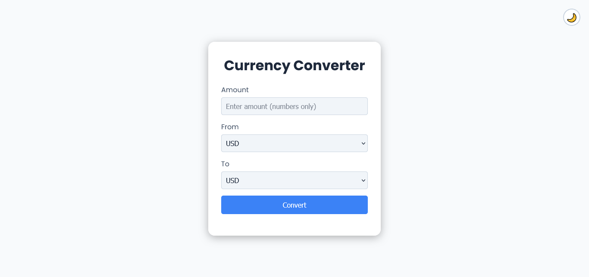

# 💱 Currency Converter PWA

A modern, fast, and responsive **Progressive Web App (PWA)** built using **HTML**, **CSS**, and **JavaScript**. It fetches exchange rates from the ExchangeRate API and allows users to convert between 150+ world currencies.

## ✨ Features

- 📱 **PWA Ready:** Installable on desktop and mobile for a native app experience.
- 🌐 **Offline Support:** Uses a Service Worker and local data caching (30-minute expiry) to work even without an internet connection.
- 💾 **Conversion History:** Automatically saves recent conversions to local storage, which can be reused or even act as an offline conversion fallback.
- 🎨 **Dark/Light Theme:** Includes a toggle to switch between dark and light modes.
- 🔄 **Live Rates:** Fetches up-to-date exchange rates for accurate conversions.
- 🧠 **Input Validation:** Ensures only valid amounts are entered.
- 📐 **Responsive Layout:** Optimized for mobile, tablet, and desktop screens.

## 🖼️ Preview

## ⚙️ API Used

**Exchange Rate API**
🔗 [https://api.exchangerate-api.com/v4/latest/USD](https://api.exchangerate-api.com/v4/latest/USD)

> _Note:_ The free tier of this API often requires **USD as the base currency** for fetching all rates. The app's logic is built around this to ensure accurate cross-currency conversions.

## 🚀 Future Improvements

- ⚠️ **Enhanced Error Handling:** Improve the user feedback when API requests fail, especially during the initial load when no cached data exists.
- 🌍 **Localization:** Add support for different languages for a wider user base.
- 📈 **Historical Trends:** Integrate charts or a separate view to show how a conversion rate has changed over time.
